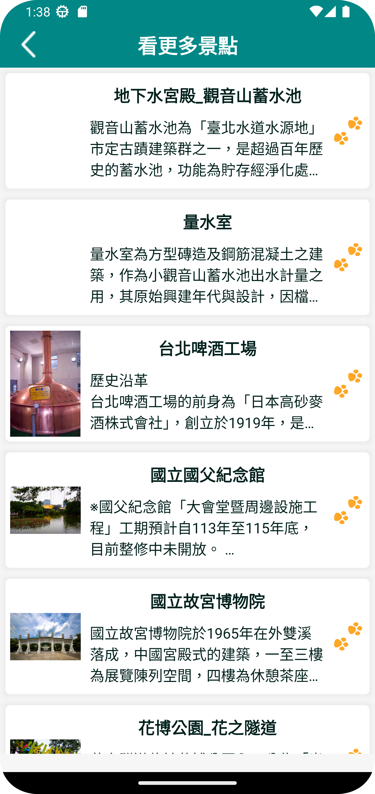
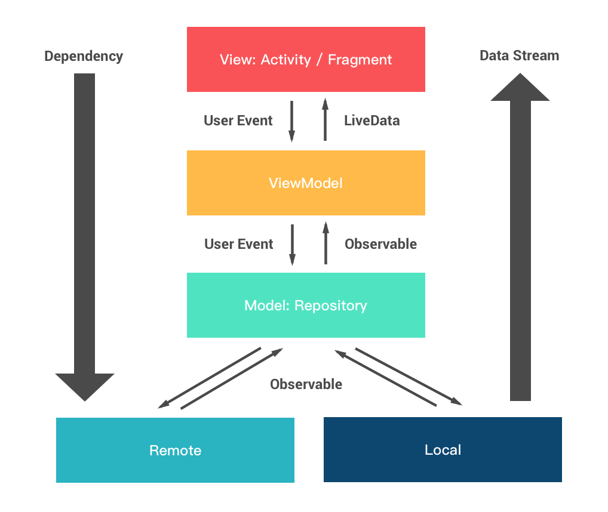

<h1 align="center">Travel Doggy</h1>


<div align="center">
  Travel Doggy is a sample Android project using <a href="https://www.travel.taipei/open-api/en">The Travel Taipei Open API</a> based on MVVM architecture.
</div>


<div align="center">
  
|  That's Check it out now! 🎉 |
|-------------------------------|

</div>

<p align="center">
  
   
   
   
   
   
   
</p>

---

## Features

<table>
  <tr>
    <td>
      <ul>
        <li>100% Kotlin</li>
        <li>MVVM architecture</li>
        <li>Reactive pattern</li>
        <li>Single activity pattern</li>
        <li>Custom View</li>
        <li>Android Architecture Components</li>
        <li>Kotlin Coroutines + Flow </li>
        <li>Use Paging3 for list view </li>
        <li>Dependency injection</li>
        <li>Jetpack Compose(Upcoming)</li>
        <li>CI support (Upcoming)</li>
        <li>Testing (Upcoming)</li>
      </ul>
    </td>
    <td>
      
    </td>
  </tr>
</table>

---
## Tech Stacks

- **Retrofit** - RESTful API and networking client.
- **Android Architecture Components** - A collections of libraries that help you design robust, testable and maintainable apps.
  - **Paging 3** - Pagination loading for RecyclerView.
  - **ViewModel** - UI related data holder, lifecycle aware.
  - **LiveData** - Observable data holder that notify views when underlying data changes.
  - **View Binding** - Simplifies UI component binding and code generation
  - **Navigation component** - Fragment routing handler. 
- **Flow** - Stream of value that returns from suspend function.
- **Coroutine** - Concurrency design pattern for asynchronous programming.
- **(Implementing) Jetpack Compose** - Declarative and simplified way for UI development.

---
## Architectures

<p align="center">
  
</p>

---
## Package Structures

```plaintext
com.taipeiTravelGuide              # Root Package
├── connect                        # Remote API Service
│   ├── request                    # Requests for API data
│   ├── response                   # Responses from API data
│   
├── data                           # Pagination logic handled by PagingSource and repository
│   
├── di                             # DI pattern mainly utilizes the Paging3 framework architecture
│   ├── factory                    # Creates ViewModel Factory
│   
├── model                          # Model classes
│   
├── view                           # Activities / Custom Views / Dialogs / Fragments / Applications
│   ├── activity                   # Launches Landing Page and MainActivity
│   ├── customView                 # Custom Rotate ImageView Banner
│   ├── dialog                     # Dialog Component
│   ├── fragment                   # All fragment views
│   │   ├── common                 # Shared components required by all fragments
│   │   ├── homePage               # Home Fragment View
│   │   ├── hotNewsPage            # Hot News Fragment View
│   │   ├── travelSpotPage         # Travel Spot Fragment View
│   │   
│   ├── TaipeiTravelApplication    # Application
│   
└── viewModel                      # ViewModel used by all pages, which holds UI-related data and is lifecycle-aware.


